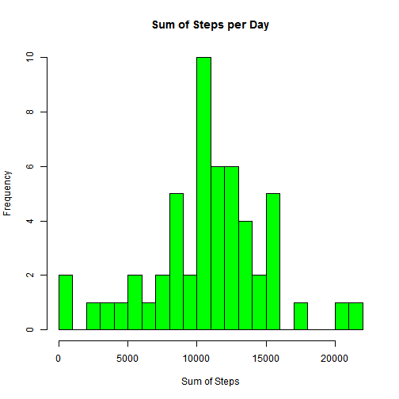

## Loading and preprocessing the data
# 1. Load the data

```r
url <- "https://d396qusza40orc.cloudfront.net/repdata%2Fdata%2Factivity.zip"
download.file(url,"./repdata.zip",mode="wb")
unzip("./repdata.zip", exdir = ".")
dataCsv <- read.csv("./activity.csv")
```
# 2. Process/transform the data

```r
dataCsv$realDate <- as.Date(dataCsv$date, format='%Y-%m-%d')
dataAgg <- aggregate(steps~realDate, dataCsv, sum)
```


## What is mean total number of steps taken per day?
# 1. Make a histogram of the total number of steps taken each day

```r
hist(dataAgg$steps, xlab="Sum of Steps", breaks = 20, col = "green", main = "Sum of Steps per Day")
```

 
# 2. Calculate and report the mean and median total number of steps taken per day

```r
mean(dataAgg$steps)
```

```
## [1] 10766.19
```

```r
median(dataAgg$steps)
```

```
## [1] 10765
```

## What is the average daily activity pattern?
# 1. Make a time series plot

```r
dataAgg$DayOfWeek <- weekdays(dataAgg$realDate)
AverageDaily <- tapply(dataCsv$steps, dataCsv$interval, mean, na.rm = TRUE)
plot(row.names(AverageDaily),
     AverageDaily,
     col = "green",
     main = "Time Series Plot",
     xlab = "5-Minute Intervals",
     ylab = "Daily Average",
     type="l")
```

 
# 2. Which 5-minute interval, on average across all the days in the dataset, contains the maximum number of steps?

```r
AvgDailyNames <- which.max(AverageDaily)
names(AvgDailyNames)
```

```
## [1] "835"
```

## Imputing missing values

# 1. Calculate and report the total number of missing values in the dataset (i.e. the total number of rows with NAs)

```r
print(sum(is.na(dataCsv$steps)))
```

```
## [1] 2304
```

# 2. Devise a strategy for filling in all of the missing values in the dataset. 

```r
dataCsvMean <- aggregate(steps ~ interval, dataCsv, mean)

head(dataCsvMean)
```

```
##   interval     steps
## 1        0 1.7169811
## 2        5 0.3396226
## 3       10 0.1320755
## 4       15 0.1509434
## 5       20 0.0754717
## 6       25 2.0943396
```

# 3. Create a new dataset that is equal to the original dataset but with the missing data filled in

```r
mergedDataCsv <- merge(x=dataCsv, y=dataCsvMean, by = "interval")

mergedDataCsv$steps <- ifelse(is.na(mergedDataCsv$steps.x), mergedDataCsv$steps.y, mergedDataCsv$steps.x) 

dataCsvWithoutNA <- mergedDataCsv[c("date","interval","steps")]
```

#4. Make a histogram of the total number of steps taken each day and Calculate and report the mean and median total number of steps taken per day. Do these values differ from the estimates from the first part of the assignment? What is the impact of imputing missing data on the estimates of the total daily number of steps?

```r
dataCsvWithoutNA$realDate <- as.Date(dataCsvWithoutNA$date, format='%Y-%m-%d')

dataAggWithoutNA <- aggregate(steps~realDate, dataCsvWithoutNA, sum)

hist(dataAggWithoutNA$steps, 
     xlab="Sum of Steps", 
     breaks = 20, 
     col = "green", 
     main = "Sum of Steps per Day (no NA values)")
```

 

```r
mean(dataAggWithoutNA$steps)
```

```
## [1] 10766.19
```

```r
median(dataAggWithoutNA$steps)
```

```
## [1] 10766.19
```

## Are there differences in activity patterns between weekdays and weekends?

```r
dataCsvWithoutNA$DayOfWeek <- weekdays(dataCsvWithoutNA$realDate)
dataCsvWithoutNA$dayIndicator <- ifelse(dataCsvWithoutNA$DayOfWeek %in% c("Saturday", "Sunday"), "Weekend", "Weekday")
dataCsvWithoutNA$dayIndicator <- as.factor(dataCsvWithoutNA$dayIndicator)

stepsAverageWkendWkday <- aggregate(steps~dayIndicator+interval, data=dataCsvWithoutNA, FUN=mean)
xyplot(steps ~ interval | dayIndicator, 
       stepsAverageWkendWkday,
       col = "red",
       main = "Time Series Plot",
       xlab = "5-Minute Intervals",
       ylab = "Daily Average",
       layout = c(1,2),
       type = "l")
```

 

## End of Document

